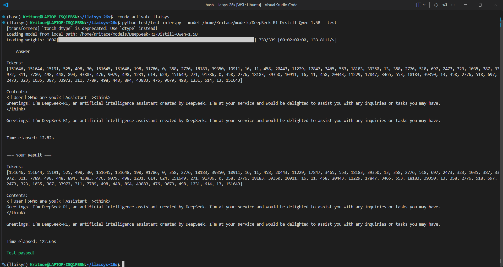
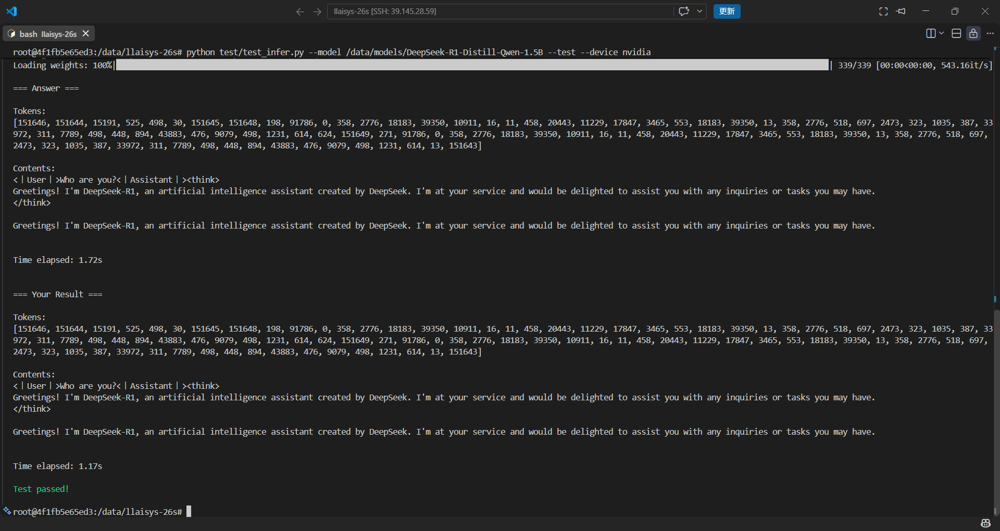
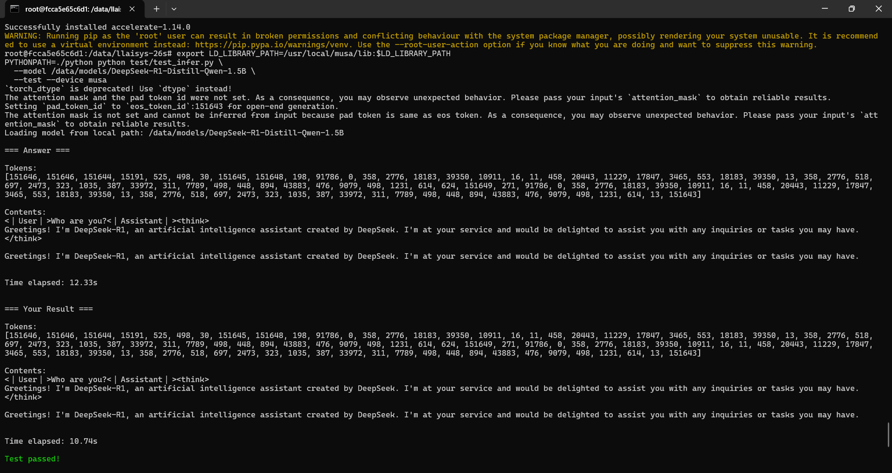

# LLAISYS 作业报告

> LLAISYS（Let's Learn AI SYStem）：C++ 后端 + Python 前端 + C API 的 AI 推理系统。
> 模型 DeepSeek-R1-Distill-Qwen-1.5B（bf16）；本地 CPU / 服务器 Nvidia / 服务器 MUSA 三平台推理全部 `Test passed`。

---

## 1. 复现流程

CPU 编译：

```bash
xmake
xmake install
pip install ./python/
python test/ops/add.py --device cpu
python test/test_infer.py --model [dir_path/to/model] --test --device cpu
```

NVIDIA：

```bash
xmake f --nv-gpu=y -cv
xmake
xmake install
pip install ./python/
python test/ops/add.py --device nvidia
python test/test_infer.py --model [dir_path/to/model] --test --device nvidia
```

摩尔线程 MUSA：

```bash
export PATH=/usr/local/musa/bin:$PATH
export LD_LIBRARY_PATH=/usr/local/musa/lib:$LD_LIBRARY_PATH
bash scripts/build_musa.sh
xmake f --musa-gpu=y -cv
xmake
xmake install
pip install ./python/
python test/ops/add.py --device musa
python test/test_infer.py --model [dir_path/to/model] --test --device musa
```

> 其余算子（argmax / embedding / linear / rms_norm / rope / self_attention / swiglu）同理，`test/ops/<op>.py` 支持 `--device {cpu,nvidia,musa}`。

---

## 2. 主要添加与改动文件

### 新增

```text
src/device/nvidia/nvidia_runtime_api.cu     # CUDA Runtime API
src/device/musa/musa_runtime_api.mu         # MUSA Runtime API（cuda* → musa*）
src/ops/<op>/{nvidia,musa}/                 # 8 个算子 × 2 平台实现
src/utils/cuda_check,cublas_utils           # CUDA / cuBLAS 工具
src/utils/musa_check,mublas_utils           # MUSA / mublas 工具
src/utils/matmul_cpu.hpp                    # CPU 矩阵乘工具
xmake/{nvidia,musa}.lua                     # 平台构建规则
scripts/build_musa.sh                       # mcc 预编译 .mu → .a
```

### 修改

```text
include/llaisys.h                           # 新增 DeviceType.MUSA
src/device/runtime_api.hpp/.cpp             # 分派新增 MUSA 分支
src/ops/<op>/op.cpp                         # 分派新增 MUSA case
src/models/qwen2/ + src/llaisys/            # GPU 推理修复（D2H / D2D 拷贝）
xmake.lua                                   # 新增 musa-gpu 编译选项
python/llaisys/libllaisys/ + test/          # Python 与测试支持 musa 设备
```

---

## 3. 算子实现与验证

### 3.1 CPU 算子

实现 7 个算子的 CPU 版本（argmax / embedding / linear / rms_norm / rope / self_attention / swiglu），
支持 f32 / f16 / bf16；`test/ops/*.py --device cpu` ，全部通过。

### 3.2 GPU 算子

- **Nvidia（cuBLAS）**：7 个算子实现 CUDA 版本，`linear` / `self_attention` 用 `cublasGemmEx`，
  `--device nvidia` 测试通过。
- **MUSA（mublas）**：7 个算子实现 MUSA 版本（`cuda*`→`musa*`），`linear` / `self_attention` 用 `mublasGemmEx`，
  `--device musa` 测试通过（f16 例外，见 5. 未修复 Bug）。

### 3.3 算子性能对比（--profile）

`test/ops/<op>.py --device nvidia --profile` 逐算子计时 LLAISYS 与 PyTorch。下表为各算子 f32 大 shape 数据：

| 算子 | LLAISYS | PyTorch | 加速比 |
|---|---|---|---|
| argmax | 0.118 | 0.038 | 0.32× |
| embedding | 0.111 | 0.035 | 0.32× |
| linear | 5.824 | 5.750 | 0.99× |
| rms_norm | 0.277 | 0.445 | 1.61× |
| rope | 0.557 | 2.428 | 4.36× |
| self_attention | 0.287 | 0.383 | 1.33× |
| swiglu | 0.310 | 0.714 | 2.30× |

> 数据来源：本机 RTX 3050 Laptop（sm_86, 4GB），`--device nvidia`，f32 大 shape。

---

## 4. 模型推理验证

### 4.1 机器配置

| 平台 | 设备 | 
|---|---|
| CPU（本机） | AMD Ryzen 5 5600H（6C12T） |
| Nvidia（服务器） | RTX 5090（32GB） | 
| MUSA（服务器） | MTT S5000（80GB） |

### 4.2 推理测试结果

三个平台执行，LLAIYS 生成结果与 PyTorch 参考逐 token 完全一致，均 `Test passed!`。



*图 1：本地 CPU 平台，`Test passed!`，与 PyTorch 逐 token 一致。*



*图 2：服务器 Nvidia 平台（RTX 5090），`Test passed!`，与 PyTorch 逐 token 一致。*



*图 3：服务器 MUSA 平台（MTT S5000），`Test passed!`，与 PyTorch 逐 token 一致。*

### 4.3 端到端推理耗时对比

| 平台 | LLAISYS | PyTorch | 加速比 |
|---|---|---|---|
| CPU（本机） | 122.66s | 12.82s | 0.10×（PyTorch 多线程优化） |
| Nvidia（服务器） | 1.17s | 1.72s | 1.47× |
| MUSA（服务器） | 10.74s | 12.33s | 1.15× |

> Nvidia / MUSA 上 LLAIYS 均快于 PyTorch；CPU 上 LLAIYS 为朴素单线程实现，明显慢于 PyTorch。

---

## 5. 未修复 Bug：mublas 4.3.5 的 f16 GEMM 数值不可靠

目前仍有一个已知不足：在 MUSA 平台上，我对 f16 的 `mublasGemmEx` 使用还不够完善，部分情况下会返回成功却得到错误的数值结果
（例如大 shape 时 linear 的 f16 相对误差接近 100%，self_attention 的 f16 输出为全 0），而 bf16 与 f32 完全正确。
由于模型推理使用 bf16（精度有保证，三平台均通过测试），该问题不影响本次作业目标。这是我目前实现上的不足，后续会继续研究改进。
